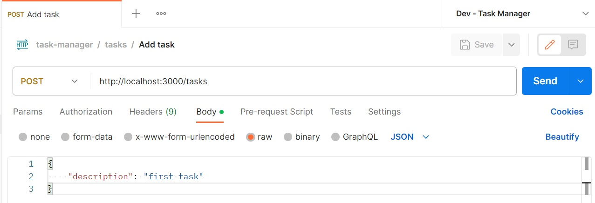
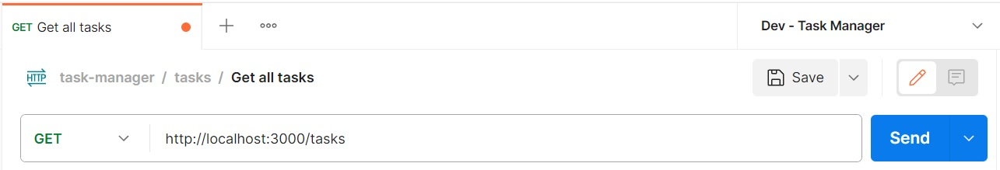

# Task Manager Node Server

This node app provides GET and POST APIs for tasks.

## Setup

- Setup mongoDb on your PC
- Setup the environment variables according to the template_dev.envv
- Name the file dev.env
- Run 'npm install'
- Run 'npm run dev' for running in dev environment

## Features
Following features are available in this node app - 

### 1. Add task to tasks collection
You can add a new task to tasks collection using the following post request - 

### 2. Get all tasks
You can get all tasks from tasks collection using the following get request - 

## Main topics

Following Node/JS topics are are the main focus in this node app - 

- REST APIs
- CRUD operations on mongodb
- Promises and promise chaining
- Async/ await
- Status codes
- MongoDb Collection-Association

## Node/JS Topics covered

Following Node/JS topics are covered in this node app - 

- Importing files/npm modules
- Error handling
- Http request, response and error handling
- Callback functions and chaining
- Express